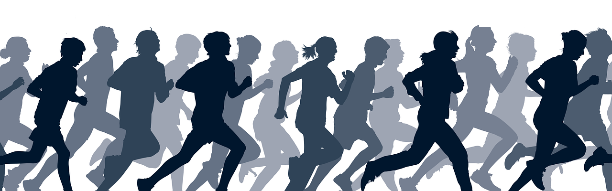

```{r setup, include=FALSE}
devtools::install_github("dgonxalex80/paqueteMET")
library(flexdashboard)
library(ggplot2)
library(paqueteMET)
data("CarreraLuz22")

Theme2 = theme(
  axis.title.x = element_text(size = 8),
  axis.text.x = element_text(size = 8),
  axis.title.y = element_text(size = 8),
  axis.text.y = element_blank(),
  axis.text = element_text( size = 8),
  legend.title = element_text(size = 8),
  legend.text = element_text(size = 8),  
  strip.text = element_text(size=8),
  title =element_text(size=8, face='bold')
)

CarreraLuz22$sex[CarreraLuz22$sex == "M"]="Hombre"
CarreraLuz22$sex[CarreraLuz22$sex == "F"]="Mujer"

CarreraLuz22M = subset(CarreraLuz22, CarreraLuz22$sex=="Hombre")
CarreraLuz22F = subset(CarreraLuz22, CarreraLuz22$sex=="Mujer")

CarreraLuz22_c1M = subset(CarreraLuz22M, CarreraLuz22M$categoria=="1. Juvenil")
CarreraLuz22_c2M = subset(CarreraLuz22M, CarreraLuz22M$categoria=="2. Abierta")
CarreraLuz22_c3M = subset(CarreraLuz22M, CarreraLuz22M$categoria=="3. Veteranos A")
CarreraLuz22_c4M = subset(CarreraLuz22M, CarreraLuz22M$categoria=="4. Veteranos B")
CarreraLuz22_c5M = subset(CarreraLuz22M, CarreraLuz22M$categoria=="5. Veteranos C")

CarreraLuz22_c1F = subset(CarreraLuz22F, CarreraLuz22F$categoria=="1. Juvenil")
CarreraLuz22_c2F = subset(CarreraLuz22F, CarreraLuz22F$categoria=="2. Abierta")
CarreraLuz22_c3F = subset(CarreraLuz22F, CarreraLuz22F$categoria=="3. Veteranos A")
CarreraLuz22_c4F = subset(CarreraLuz22F, CarreraLuz22F$categoria=="4. Veteranos B")
CarreraLuz22_c5F = subset(CarreraLuz22F, CarreraLuz22F$categoria=="5. Veteranos C")

categoria= c("Juvenil","Abierta","Veteranos A", "Veteranos B","Veteranos C")
t2 = aggregate(CarreraLuz22$timerun/60, by=list(CarreraLuz22$categoria,CarreraLuz22$sex), FUN= summary)
t2=t2$x
t2m=t2[1:5,] 
row.names(t2m)=categoria
t2h=t2[6:10,] 
row.names(t2h)=categoria
```

Column {data-width=750 .tabset}
-----------------------------------------------------------------------

### Tiempos de Carrera

```{r}
#paleta6= c(CarreraLuz22M="#1874CD",CarreraLuz22F="#CD2626")
p1=ggplot(CarreraLuz22, aes(y=timerun/60, x=categoria, colour= CarreraLuz22$sex))+
  geom_jitter() +
  facet_wrap(~ sex,ncol = 1)+
  labs(title = "Tiempos de carrera por categoría",
       y= "Tiempo en minutos",
       x= "Categorías")+ 
  ylim(0,170)+
  Theme2

p1
```

### Hombre por categoría

```{r, fig.height=3}
ggplot(CarreraLuz22M, aes(x = categoria, y = timerun/60 )) +
  geom_boxplot(aes(fill = categoria)) + 
  labs(title = "Tiempo hombres por categoría", y= "tiempo - min", x= "categorías")+
  scale_fill_brewer() +
  theme(legend.position = "none")
t2h
```

### Mujer por categoría
```{r, fig.height=3}
ggplot(CarreraLuz22F, aes(x = categoria, y = timerun/60 )) +
  geom_boxplot(aes(fill = categoria)) + 
  labs(title = "Tiempo mujeres por categoría", y= "tiempo - min", x= "categorías")+
  scale_fill_brewer() +
  theme(legend.position = "none")
t2m
```


### Información de la convocatoria
```{r, echo=FALSE, out.width="30%", fig.align = "center"}

```

**10.07 K** Participantes desde los 15 años en adelante.

**Salida**: Hotel Intercontinental, calle 5, Carrera 6, carrera 4c, carrera1, carrera 4, calle de la escopeta, museo arqueológico la merced, bulevar del rio, puente Ortiz, av 2N, parque lineal rio Cali av2n, calle 25, parque lineal av1n, calle 13, carrera 1 calle 12, carrera 5, calle 10, gobernación del valle, edificio Aristi carrera 9, calle 9 plazoleta de san francisco, bulevar del rio, calle 8, carrera 4, carrera 3ª, parque del peñón, carrera 3, carrera 3ª oeste, calle 5 oeste, carrera 4, av Belalcázar, carrera 2ª oeste, librería nacional, carrera 1c, museo la tertulia, av Colombia, pepe ganga, carrera 3, carrera 2, carrera 3ª, av Colombia, carrera 4, meta hotel intercontinental. [juanchocorrelon.com](https://juanchocorrelon.com/intercontinental-10k-luz-2022/#10k)


### Análisis:
$$**Análisis**$$
La carrera de la luz de 2022, fue un espacio de sana competencia en el que participaron 1922 personas de diferentes partes del país y de otros paises como Venezuela y Alemania (DEU), entre mujeres y hombres de distintas edades, desde los 15 años, e incluso personas con algún grado de discapacidad, realizado en Cali - Colombia. 

Ya enfocándonos un poco en los resultados del análisis exploratorio realizado, encontramos que, de las cinco categorías, la categoría abierta obtuvo la mayor cantidad de participantes, como era probablemente esperado, no obstante, llama la atención como la categoría juvenil contó con tan 'pocos' corredores. En cuanto al sexo, se evidencia que, las mujeres tienen mejores promedios (media: 61.9 cat. Abierta) frente a los hombres (media: 70.1 cat. Abierta). Incluso los tiempos mínimos son mejores en las mujeres. Todo esto, a pesar de que, el porcentaje de participación de hombres (61.3%) fuera mayor que el de las mujeres con un 38.7%, lo que haría pensar que existiría una probabilidad aparente de encontrar más participantes hombres con las capacidades para superar a las mujeres. 


Column {data-width=350}
-----------------------------------------------------------------------

### Tiempo mujeres - Categoría Abierta

```{r}
dataFc2=subset(CarreraLuz22, (CarreraLuz22$sex=="Mujer" & CarreraLuz22$categoria=="2. Abierta")) 
x=dataFc2$timerun/60
hist(x, xlim=c(30,110), ylim=c(0,80),las=1,
main = "Mujeres categoría Abierta",
xlab="Tiempo (min)",
ylab = "Frecuencia",
col ="#FF69B4")
```

### Tiempo hombres - Categoría Abierta

```{r}
dataMc2=subset(CarreraLuz22, (CarreraLuz22$sex=="Hombre" & CarreraLuz22$categoria=="2. Abierta")) 
x=dataMc2$timerun/60
hist(x, xlim=c(30,120), ylim=c(0,250),las=1,
main = "Hombres categoría Abierta",
xlab="tiempo (min)",
ylab = "frecuencia",
col ="#87CEFA")
```

Column { data-width=40 }
-----------------------------------------------------------------------

### Mínimo  {.value-box}
```{r}
valueBox(value =paste(round(min(CarreraLuz22$timerun/60),1), "min"), 
         caption = "Tiempo ganador", 
         icon = "fa-thumbs-up", 
         color = "#FFD700")
```

### Velocidad  {.value-box}
```{r}
valueBox(value =paste(round(10070/min(CarreraLuz22$timerun),2),"m/s"),  
         caption = "Máxima velocidad", 
         icon = "fa-clock", 
         color = "#FFD700")
```

### Distancia  {.value-box}
```{r}
valueBox(value = paste(10.07,"Km"),  
         caption = "Distancia recorrida", 
         icon = "", 
         color = "#FFD700")
```

### Volumen  {.value-box}
```{r}
valueBox(value = paste(length(CarreraLuz22$timerun),"atletas"), 
         caption = "Número de participantes", 
         icon = "fa-people", 
         color = "#FFD700")
```

### Porcentaje  {.value-box}
```{r}
valueBox(value = paste(round(length(CarreraLuz22F$timerun)/length(CarreraLuz22$timerun)*100,2),"%"), 
         caption = "Porcentaje mujeres", 
         icon = "  ", 
         color = "#FFD700")
```

### Promedio  {.value-box}
```{r}
valueBox(value = paste(round(mean(CarreraLuz22$timerun/60),2),"min"), 
         caption = "Tiempo promedio de carrera", 
         icon = "  ", 
         color = "#FFD700")
```


